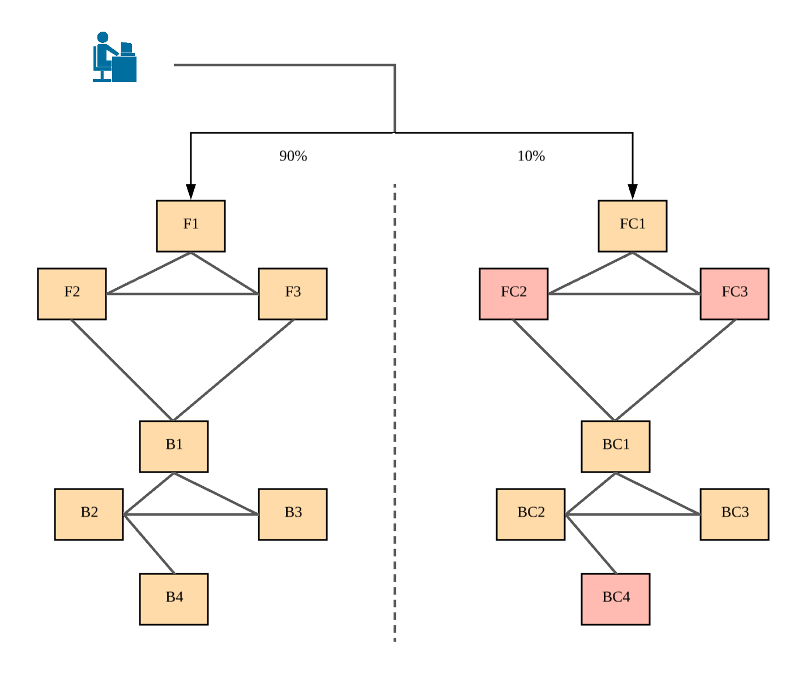
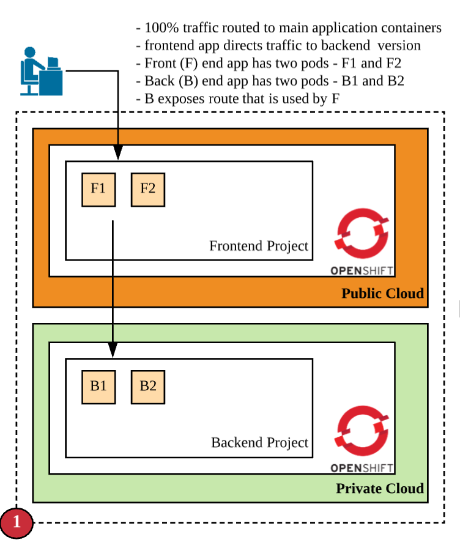
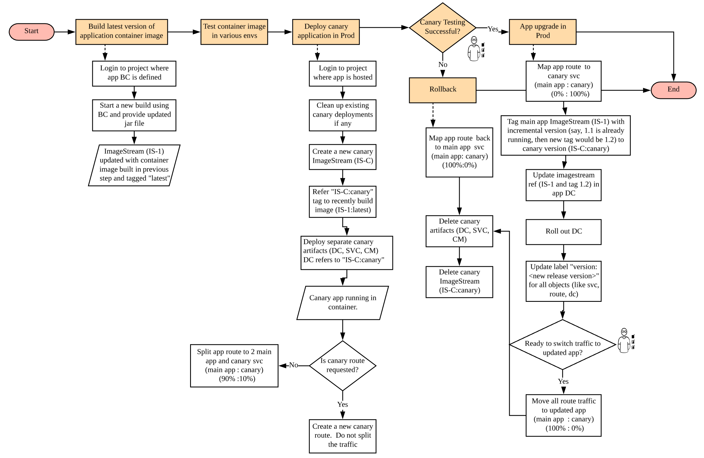
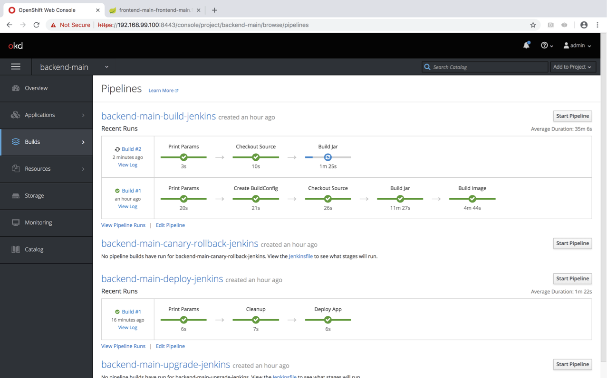
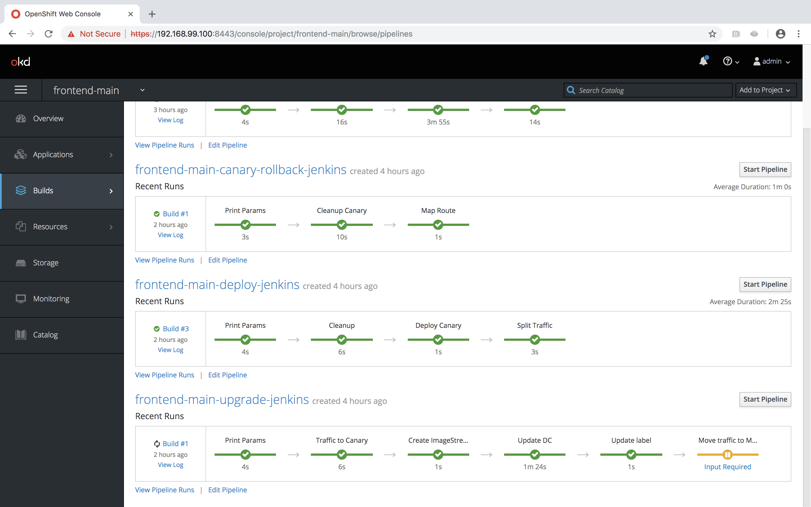

= Orchestrating Canary Release for Multiple Applications in Openshift/Kubernetes

=== Introduction

This demo aims to provide starting point/code-sample to do canary releases on Openshift Container Platform. Below code has been tested on following environments

minishift
Openshift version v3.11.0

=== Challenges

Canary release is a deployment strategy where a new version of an application (called canary) is running simultaneously with previous version. Very limited traffic is diverted to canary version to see if the application is behaving as expected. Once results are confirmed, the existing application is upgraded to the new version and entire traffic is now served to the new version. On the other hand if there is a problem with canary version, traffic is simply diverted back to the existing version.

Canary release becomes extremely complex to handle if there are multiple microservices involved and all (or some of them) need to be updated via canary release mechanism. Let me expand more on this - 

Assume there are two openshift envs. One environment is running on public cloud and hosts public facing web applications/microservices. Other environment is hosted on private cloud and hosts internal applications/microservices that handle incoming traffic from frontend application. Now, since these applications are running independently in their own openshift cluster, many times it may be required that both frontend and backend application need to be updated simultaneously, and both require to test canary version first and then update if everything is ok. This is not an easy and straightforward problem.

And this demo aims to put across some thought and strategy on how this could be achieved.

=== Solution Architecture

The idea/strategy is that if you have bunch of related microservices and you would like to perform canary upgrade for them in a coordinated manner, then you would need to perform following -

a. Identify at which microservice traffic is going to be split
b. Understand how microservices are communicating (via routes or via service)
c. Deploy complete topology again as a canary. If there are some microservice that are not changed, then deploy the same version (which is running in prod) as a canary. For example - in below figure F1, B1, B2 and B3 are not changed. Therefore, their canaries are same images that are running in production.
d. Deploy canaries bottom up. Therefore B4 canary is deployed first, followed by B2 and in the last F1. Then the traffic is split.
e. Once canaries are ok, then you should switch all traffic to canary toplogy and perform the upgrade. 
f. Once upgrade is completed, then traffic should be switched. Move all the traffic to F1 and start deleting canaries top down. 

Many things will get clearer in below sections. Keep reading!

The set up for this demo is shown in below figure. We could easily extend this setup to more than two microservices

a. F1 and F2 are two pods of frontend application (F)
b. B1 and B2 are two pods of backend application (B)
c. B exposes a route that used by F. F uses configmap to store B's route information, which is injected when F is deployed
d. 100% traffic is routed to F

Now, we should be able to cater to following use cases -

a. Only F is upgraded
b. Only B is upgraded
c. Both F and B need to be upgraded simultaneously

It is required that all upgrades to any application be done via canary release mechanism.

Before, we jump into solution, let's see how we could do canary style upgrades in Openshift. Below figure outlines the approach. 

Things to note -

a. We are not focusing on how to build and tag images during build phase
b. We are not focusing on how to move the image across various non-prod envs
c. We are only focusing in situation when once an image is ready to be deployed to production, how do we perform canary style upgrade

"*Build latest version of application container image*" step in above aims to create an imagestream marked with some tag. Since our solution does not focus on tagging and building, in our followup demo we would just build an image using binary build in Openshift and tag it to latest. 

"*Test container image in various envs*" step does the routine testing (SIT, UAT, Integration etc) and once it is establised that the image is ready to be pushed to production, we move to next step

"*Deploy Canary application in Prod*" step assumes that some version of image is already running in production and we now have to perform the canary upgrade. Following tasks happens in this stage. 

a. The canary is deployed in the same namespace/project as the prod application's namespace/project. It cleans up all canary related artifacts (like deployment config, image stream, routes, services, config maps etc of the canary) if they exist.
b. A new imagestream (app-name-canary) is created a new tag "canary" is created which points to the image we want to refer created during build phase.
c. A separate deployment config, service, route, config map for the canary is created in the same namespace/project.
d. As part of deployment it is required from operator deploying the canary application whether this canary needs a separate route or not. In our example since frontend app (F) communicates to backend app (B), we need to have a canary route for B's canary so that F's canary always call B's canary via the new canary route. So, if a canary route is requested, a new route is created. And if not, then B's route is updated to divert 10% of the traffic to B's canary version.
In our example above, when we would deploy F's canary, we would not require a new route because F's route is exposed to end user. F's route would be updated to send 10% of traffic to F's canary's service url. Once traffic is already split at front end application, it should now be diverted to all canary versions (whether backend or frontend). Therefore F' canary will divert all traffic to B's canary and that is why B's canary require a dedicated canary route.

"*Canary Testing Successful*" is a manual step and waits for input to either rollback or upgrade main application to newer version

"*Rollback*" step maps the route to divert all traffic to main application's service url and it deletes all canary artifacts. 

"*App upgrade in prod*" step does following -

a. It first maps all traffic coming to the application to canary version. In our example, frontend application (F) route now diverts all traffic to F's canary service url. F's canary diverts all traffic already to B's canary already as explained earlier. There is no traffic coming to F now, which implies that there is no traffic coming to B as well. B's route is also mapped to B's canary service url. B's canary also had a canary route.
b. Now we figure out what new tag needs to be created. Once that is completed application's imagesteam and the new tag refers to the canary's imagestream and "canary" tag which was created during "Deploy canary application in Prod" step b. 
c. Main application's deployment config is updated to refer to this new imagestream and tag. 
d. Deployment config is rolled out. 
e. All artifacts for main application are updated with right label (version: <new version>) 
f. Now we could have deleted the canary version straight away, however we added a manual step here. This will become clearer in next section where we need to coordinate switching traffic back to main application when there are multiple applications/microservices involved during canary release.
g. Once approved, traffic is moved back to main application (which is updated now) and all canary artifacts are deleted.

This demo focuses on two microservice, frontend and backend. However, the above strategy could be easily extended. Below figure outlines the process to upgrade F and B. 

image::docs/canary_rel-lifecycle.png[]

a. Figure 1 explains the current deployment. 
b. Figure 2 explains that both F and B's canary are deployed. B's canary has a route exposed that is used by F's canary
c. Figure 3 explains that traffic to F is split and F's route is mapped to F's service url (weightage 90%) and F's canary's service url (weightage 10%). Once 10% traffic comes to F's canary, it is pushed to B's canary.
d. Figure 4 explains that once it is established that canaries are working fine, then 100% traffic coming to F is now mapped to F's canary. Also, 100% traffic coming to B's route is mapped to B's canary. It should be noted that there would no traffic coming to B's route (because F's route is not receiving any traffic) but still we need to migrate this traffic. Why we did this would become clearer in next step. Also both F and B are upgraded at this stage. F and F's canary are using the same image and same with B and B's canary.
e. Figure 5 is where co-ordination is happening on whether to switch traffic or not. First F's traffic is switched back to F's route and canary is deleted. F calls B's route which is mapped to B's canary at the moment (we did this change in step d above). But it does not matter now because both B and B' canary are referring to same image.
f. Figure 6 depicts where decision to map B's route to B is taken and B's canary is deleted. F refer to B's route which now maps to B

=== Run Demo
==== Step 1: Install minishift
Run following command to start minishift
----
$ minishift start --memory 8GB
----

==== Step 2: Create projects
We would be creating following projects
backend-main - to run backend application and canary
frontend-main - to run frontend application and canary
backend-main-build - run build process and create images for backend-application
frontend-main-build - run build process and create images for frontend-application
cicd - to run jenkins
----
$ oc login -u admin -p admin
$ git clone https://github.com/kgshukla/canary-rel-openshift.git
$ cd canary-rel-openshift
$ ./create-projects.sh
----

The script deploys jenkins in cicd project. Make sure jenkins is up and running in cicd project before progressing further.

==== Step 3: Create applications artifacts
We would deploy 2 templates for backend and frontend application. Each template has information on deployment config, services, routes, imagestreams to be used etc
----
$ oc project backend-main
$ oc create -f backend-main/yamls/backend-main-template.yaml
$ oc process template/backend-main-template --parameters=true
NAME                DESCRIPTION                                       GENERATOR           VALUE
APP_NAME            Name of your application                                              backend-main
APP_VERSION         Version of your application                                           1.1
PROJECT             Project/Namespace to deploy your application in                       backend-main
DOMAIN_NAME         Domain name of your openshift cluster                                 192.168.99.100.nip.io
DC_NAME             Deployment Config name of your application        
----
The last command showcase you what parameters are expected when you deploy the template. This template is parameterized and is used to create both main application and it's canary. The template would be deployed by Jenkins pipeline later. DOMAN_NAME parameter value may need to be changed depending on what url minishift IP. DC_NAME parameter is special and actually helps to create multiple artifacts (like Deploymentconfig, service, route etc) based on what value is set as DC_NAME. For example, when we deploy (via jenkins pipeline) main application we would provide DC_NAME=backend-main while for canary deployment we would provide DC_NAME=backend-main-canary. 

Open backend-main-template.yaml file and see how these parameters are getting used.

Run following command to deploy frontend-main-template
----
$ oc project frontend-main
$ oc create -f frontend-main/yamls/frontend-main-template.yaml
$ oc process template/frontend-main-template --parameters=true
NAME                DESCRIPTION                                       GENERATOR           VALUE
APP_NAME            Name of your application                                              frontend-main
APP_VERSION         Version of your application                                           1.1
PROJECT             Project/Namespace to deploy your application in                       frontend-main
DOMAIN_NAME         Domain name of your openshift cluster                                 192.168.99.100.nip.io
DC_NAME             Deployment Config name of your application                            
----

==== Step 4: Deploy Jenkins Pipeline in two projects

There are 4 pipelines created for this demo -
a. app-build-pipeline-template.yaml - This pipeline builds the project and create an imagestream with tag latest
b. app-deploy-pipeline-template.yaml - This pipeline deploys image created during build process. If you are deploying for the first time, then no canary is created. When you deploy the second time, a canary is created.
c. app-upgrade-pipeline-template.yaml - Once you are done testing your canary and it turns fine, then this pipeline is invoked to upgrade the main application to latest version.
d. app-canary-rollback-pipeline.yaml - In case canary testing fails, this pipeline is invoked to delete the traffic and route the traffic to main application.

We will deploy all these pipelines in "openshift" project, so that we could invoke them for both backend and frontend apps.
----
$ oc create -f jenkins_pipeline/app-build-pipeline-template.yaml -n openshift
$ oc create -f jenkins_pipeline/app-deploy-pipeline-template.yaml -n openshift
$ oc create -f jenkins_pipeline/app-upgrade-pipeline-template.yaml -n openshift
$ oc create -f jenkins_pipeline/app-canary-rollback-pipeline-template.yaml -n openshift
----

Let's analyze each of these templates

----
$ oc process app-main-build-pipeline -n openshift --parameters=true
NAME                DESCRIPTION                                                GENERATOR           VALUE
APP_NAME            Name of the application                                                        backend-main
APP_PROJECT         Project or Namespace where application would be deployed                       backend-main
GIT_SOURCE_URL      The source URL for the application                                             https://github.com/kgshukla/canary-rel-openshift.git
GIT_SOURCE_REF      The source Ref for the application                                             master
GIT_CONTEXT_PATH    Module within git project                                                      backend-main
----

All the parameters are pretty self-explanatory here

----
$ oc process app-main-deploy-pipeline -n openshift --parameters=true
NAME                DESCRIPTION                                                GENERATOR           VALUE
APP_NAME            Name of the application                                                        backend-main
APP_PROJECT         Project or Namespace where application would be deployed                       backend-main
CANARY_URL_REQ      Does Canary version require a new url                                          true
DOMAIN_NAME         Domain name of the cluster                                                     192.168.99.100.nip.io
----

CANARY_URL_REQ is special parameter that tells pipeline whether there is a route needed for the canary. As explained earlier, backend's canary application would need a route, however frontend would not need it.

As we start this pipeline, parameters like APP_NAME, APP_PROJECT, DOMAIN_NAME would be passed to earlier application template we created.
----
$oc process app-main-upgrade-pipeline -n openshift --parameters=true
NAME                DESCRIPTION                                                GENERATOR           VALUE
APP_NAME            Name of the application                                                        backend-main
APP_PROJECT         Project or Namespace where application would be deployed                       backend-main
----

Both parameters are self-explanatory

----
$ oc process app-main-canary-rollback-pipeline -n openshift --parameters=true
NAME                DESCRIPTION                                                GENERATOR           VALUE
APP_NAME            Name of the application                                                        backend-main
APP_PROJECT         Project or Namespace where application would be deployed                       backend-main
----

Both parameters are self-explanatory

==== Step 5: Deploy backend and frontend application

Follow this link:docs/apps_deployment.pdf[pdf] to deploy these two applications via web console. You can open the console via running $minishift console command.

Make sure version=1.1 is deployed for both frontend and backend application

----
# frontend
$ oc get dc -l app=frontend-main -l version=1.1 -n frontend-main
NAME            REVISION   DESIRED   CURRENT   TRIGGERED BY
frontend-main   1          3         3         config

# backend
$ oc get dc -l app=backend-main -l version=1.1 -n backend-main
NAME            REVISION   DESIRED   CURRENT   TRIGGERED BY
backend-main    1          3         3         config

----

Our state represents stage 1 in the below diagram

image:docs/canary_rel-lifecycle.png[]

==== Step 6: Deploy canaries for both applications

We would now deploy canary version of backend and frontend applications. We will start with backend first.

----
$ vim backend-main/src/main/java/com/example/backendmain/controller/BackendMainController.java

change this line 

String mesg = "BackendMain-v1: Hello from pod - " + podName + "!";

to

String mesg = "BackendMain-v2: Hello from pod - " + podName + "!";

and exit from the file.

$ git add backend-main/src/main/java/com/example/backendmain/controller/BackendMainController.java
$ git commit -m "changed to v2"
$ git push -u origin master

----

Run "backend-main-build-jenkins" again for backend-application to build a new jar file and imagestream. This time we would start the pipeline from commandline

----
$ oc project backend-main
$ oc start-build backend-main-build-jenkins -n backend-main
build.build.openshift.io/backend-main-build-jenkins-2 started

----

Wait for the build to finish. Look at the status on web console

or run following command to verify that two images are present
----
$ oc describe is backend-main -n backend-main-build
Name:     backend-main
Namespace:    backend-main-build
Created:    43 minutes ago
Labels:     app=backend-main
      build=backend-main
      Annotations:    openshift.io/generated-by=OpenShiftNewBuild
      Docker Pull Spec: 172.30.1.1:5000/backend-main-build/backend-main
      Image Lookup:   local=false
      Unique Images:    2
      Tags:     1

      latest
        no spec tag

          * 172.30.1.1:5000/backend-main-build/backend-main@sha256:d78bb00b1dcaa65e90996c1b88cb8f87df2e17a8a01e736fe07855a7f5a723ae
                4 minutes ago
            172.30.1.1:5000/backend-main-build/backend-main@sha256:df5cb7a2b634f1937ca45fe0ef8ec6043566124025498163e6b1612d5989f22e
                26 minutes ago
----

Once build is completed, deploy canary version of backend-main via starting the "backend-main-deploy-jenkins" pipeline

----
$ oc start-build backend-main-deploy-jenkins -n backend-main
build.build.openshift.io/backend-main-deploy-jenkins-2 started

----

This will start the deployment of backend-main application. Since, this application v1 is already up and running, the pipeline would deploy a canary version of the app and would not perform a rolling upgrade.

----
$ oc get pods | grep backend-main
backend-main-1-2ql68          1/1       Running   0          29m
backend-main-1-n7pwv          1/1       Running   0          29m
backend-main-1-z6lg6          1/1       Running   0          29m
backend-main-canary-1-cg5hx   1/1       Running   0          2m
backend-main-canary-1-g8s4l   1/1       Running   0          2m
backend-main-canary-1-h7z2n   1/1       Running   0          2m

----

If you recall, while creating deploy pipeline for backend app, we specified that we need a canary url for the canary version. Run following command to make sure the canary url is working

----
$ oc get routes
NAME                  HOST/PORT                                                PATH      SERVICES              PORT       TERMINATION     WILDCARD
backend-main          backend-main-backend-main.192.168.99.100.nip.io                    backend-main          8080-tcp                   None
backend-main-canary   backend-main-canary-backend-main.192.168.99.100.nip.io             backend-main-canary   8080-tcp                   None
jenkins               jenkins-backend-main.192.168.99.100.nip.io                         jenkins               <all>      edge/Redirect   None

$ curl http://backend-main-canary-backend-main.192.168.99.100.nip.io
BackendMain-v2: Hello from pod - backend-main-canary-1-h7z2n!

$ curl http://backend-main-backend-main.192.168.99.100.nip.io
BackendMain-v1: Hello from pod - backend-main-1-n7pwv!

# to see all artifacts for canary version, run
$ oc get all -l app=backend-main -l version=canary
NAME                              READY     STATUS    RESTARTS   AGE
pod/backend-main-canary-1-cg5hx   1/1       Running   0          23m
pod/backend-main-canary-1-g8s4l   1/1       Running   0          23m
pod/backend-main-canary-1-h7z2n   1/1       Running   0          23m

NAME                                          DESIRED   CURRENT   READY     AGE
replicationcontroller/backend-main-canary-1   3         3         3         23m

NAME                          TYPE        CLUSTER-IP    EXTERNAL-IP   PORT(S)    AGE
service/backend-main-canary   ClusterIP   172.30.15.7   <none>        8080/TCP   23m

NAME                                                     REVISION   DESIRED   CURRENT   TRIGGERED BY
deploymentconfig.apps.openshift.io/backend-main-canary   1          3         3         config

NAME                                           HOST/PORT                                                PATH      SERVICES              PORT       TERMINATION   WILDCARD
route.route.openshift.io/backend-main-canary   backend-main-canary-backend-main.192.168.99.100.nip.io             backend-main-canary   8080-tcp                 None
----

Running above commands ensure that canary url is working and directing traffic to v2 version and the main application url is still intact and directs traffic to the already deployed main version (v1). Also, you could see that the canary version created its own deployment config, service, route, replication controller etc.

Let's now quickly deploy frontend canary. Our strategy was that frontend canary would direct traffic to backend canary. Frontend app was getting url from a configmap. which configmap to use is referred in deploymentconfig, which is defined in the template that we deployed (frontend-main-template.yaml) earlier. Open frontend-main-template.yaml and search for configMapRef and you would find that it refers to a configmap named {DC_NAME}-config. for canary version of frontend app the DC_NAME would generate to frontend-main-canary. Therefore we need to create a config map with this name and would provide backend.url key with canary url of backend app. In fact, every parameter that is supposed to be different for canary should be defined in this canary config map. 

----
$ oc project frontend-main
$ oc create configmap frontend-main-canary-config --from-literal=backendmain.url=http://backend-main-canary-backend-main.192.168.99.100.nip.io
configmap/frontend-main-config-canary created

# change file 
$ vim frontend-main/src/main/java/com/example/frontendmain/controller/FrontendMainController.java

# change this 
String frontendMsg = "FrontendMain-v1: served by pod - " + podName + "!"

# to 
String frontendMsg = "FrontendMain-v2: served by pod - " + podName + "!"

$ git add frontend-main/src/main/java/com/example/frontendmain/controller/FrontendMainController.java
$ git commit -m "changed to v2"
$ git push -u origin maste

# start build
$ oc start-build frontend-main-build-jenkins -n frontend-main
build.build.openshift.io/frontend-main-build-jenkins-2 started

# wait for build to finish, you could check on console or see if a new image is created in frontend-main-build project
$ oc describe is frontend-main -n frontend-main-build | grep Unique
Unique Images:    1

# wait until unique images changes to 2
$ oc describe is frontend-main -n frontend-main-build | grep Unique
Unique Images:    2

----

Now let's deploy the canary version of frontend app. Note that we didnt define during our deploy pipeline creation for frontend app that we need a new canary url for canary. This means that the main route that the frontend app has would split 90% traffic to original app while 10% to canary version.

----
$ oc start-build frontend-main-deploy-jenkins -n frontend-main
build.build.openshift.io/frontend-main-deploy-jenkins-2 started

# now wait for the deployment to complete
$ oc get pods -w | grep frontend
frontend-main-1-dhg9r          1/1       Running   0          2h
frontend-main-1-n9spz          1/1       Running   0          2h
frontend-main-1-qxv79          1/1       Running   0          2h
frontend-main-canary-1-5xr4m   1/1       Running   0          1h
frontend-main-canary-1-fxwhg   1/1       Running   0          1h
frontend-main-canary-1-nr8zs   1/1       Running   0          1h

# See the routes exposed and you would find only one
$ oc get routes | grep frontend
frontend-main   frontend-main-frontend-main.192.168.99.100.nip.io             frontend-main(70%),frontend-main-canary(30%)   8080-tcp                   None
jenkins         jenkins-frontend-main.192.168.99.100.nip.io                   jenkins                                        <all>      edge/Redirect   None

----

Now run the following script to ensure that traffic to frontend route is splitting between main version and canary version in ratio 70% and 30%.

----
$ while true; do curl http://frontend-main-frontend-main.192.168.99.100.nip.io; echo; sleep .5; done
FrontendMain-v1: served by pod - frontend-main-1-n9spz! :::: BackendMain-v1: Hello from pod - backend-main-1-2ql68!
FrontendMain-v2: served by pod - frontend-main-canary-1-fxwhg! :::: BackendMain-v2: Hello from pod - backend-main-canary-1-h7z2n!
FrontendMain-v2: served by pod - frontend-main-canary-1-5xr4m! :::: BackendMain-v2: Hello from pod - backend-main-canary-1-g8s4l!
FrontendMain-v1: served by pod - frontend-main-1-qxv79! :::: BackendMain-v1: Hello from pod - backend-main-1-z6lg6!
FrontendMain-v2: served by pod - frontend-main-canary-1-nr8zs! :::: BackendMain-v2: Hello from pod - backend-main-canary-1-cg5hx!
FrontendMain-v1: served by pod - frontend-main-1-dhg9r! :::: BackendMain-v1: Hello from pod - backend-main-1-n7pwv!
FrontendMain-v1: served by pod - frontend-main-1-n9spz! :::: BackendMain-v1: Hello from pod - backend-main-1-2ql68!
FrontendMain-v1: served by pod - frontend-main-1-qxv79! :::: BackendMain-v1: Hello from pod - backend-main-1-z6lg6!
FrontendMain-v1: served by pod - frontend-main-1-dhg9r! :::: BackendMain-v1: Hello from pod - backend-main-1-n7pwv!
FrontendMain-v1: served by pod - frontend-main-1-n9spz! :::: BackendMain-v1: Hello from pod - backend-main-1-2ql68!
FrontendMain-v1: served by pod - frontend-main-1-qxv79! :::: BackendMain-v1: Hello from pod - backend-main-1-z6lg6!

----

You could now notice that 70% traffic goes to FrontendMain-v1 and 30% goes to FrontendMain-v2 (canary version). Another thing to note here is that FrontendMain-v2 (which is the canary version) directs its traffic to BackendMain-v2 (canary version). This represents stage 3 in below diagram. 

image:docs/canary_rel-lifecycle.png[]

==== Step 7: Rollback canaries

Let's say that the canary version does not work and we need to roll back, we just need to rollback frontend first and then backend. We rollback frontend first because that's where the traffic gets diverted. We created rollback pipelines for both apps, and we just need to initiate them.

----
$ oc project frontend-main
$ oc start-build frontend-main-canary-rollback-jenkins -n frontend-main
build.build.openshift.io/frontend-main-canary-rollback-jenkins-1 started

# wait for the build to finish and you would see the canary versions are all deleted
$ oc get pods -w | grep frontend
frontend-main-1-dhg9r          1/1       Running       0          3h
frontend-main-1-n9spz          1/1       Running       0          3h
frontend-main-1-qxv79          1/1       Running       0          3h

# Run the script again to see 100% traffic is diverted to v1 version
$ while true; do curl http://frontend-main-frontend-main.192.168.99.100.nip.io; echo; sleep .5; done
FrontendMain-v1: served by pod - frontend-main-1-qxv79! :::: BackendMain-v1: Hello from pod - backend-main-1-n7pwv!
FrontendMain-v1: served by pod - frontend-main-1-dhg9r! :::: BackendMain-v1: Hello from pod - backend-main-1-2ql68!
FrontendMain-v1: served by pod - frontend-main-1-n9spz! :::: BackendMain-v1: Hello from pod - backend-main-1-z6lg6!
FrontendMain-v1: served by pod - frontend-main-1-qxv79! :::: BackendMain-v1: Hello from pod - backend-main-1-n7pwv!
FrontendMain-v1: served by pod - frontend-main-1-dhg9r! :::: BackendMain-v1: Hello from pod - backend-main-1-2ql68!
FrontendMain-v1: served by pod - frontend-main-1-n9spz! :::: BackendMain-v1: Hello from pod - backend-main-1-z6lg6!
FrontendMain-v1: served by pod - frontend-main-1-qxv79! :::: BackendMain-v1: Hello from pod - backend-main-1-n7pwv!
FrontendMain-v1: served by pod - frontend-main-1-dhg9r! :::: BackendMain-v1: Hello from pod - backend-main-1-2ql68!
FrontendMain-v1: served by pod - frontend-main-1-n9spz! :::: BackendMain-v1: Hello from pod - backend-main-1-z6lg6!
FrontendMain-v1: served by pod - frontend-main-1-qxv79! :::: BackendMain-v1: Hello from pod - backend-main-1-n7pwv!
FrontendMain-v1: served by pod - frontend-main-1-dhg9r! :::: BackendMain-v1: Hello from pod - backend-main-1-2ql68!
FrontendMain-v1: served by pod - frontend-main-1-n9spz! :::: BackendMain-v1: Hello from pod - backend-main-1-z6lg6!

# Ensure that backend-canary still exists
$ oc get pods -n backend-main | grep backend
backend-main-1-2ql68          1/1       Running   0          1h
backend-main-1-n7pwv          1/1       Running   0          1h
backend-main-1-z6lg6          1/1       Running   0          1h
backend-main-canary-1-cg5hx   1/1       Running   0          1h
backend-main-canary-1-g8s4l   1/1       Running   0          1h
backend-main-canary-1-h7z2n   1/1       Running   0          1h

# and the backend canary url is also active. It's just that no frontend app is pushing traffic to it
$ oc get routes -n backend-main
NAME                  HOST/PORT                                                PATH      SERVICES              PORT       TERMINATION     WILDCARD
backend-main          backend-main-backend-main.192.168.99.100.nip.io                    backend-main          8080-tcp                   None
backend-main-canary   backend-main-canary-backend-main.192.168.99.100.nip.io             backend-main-canary   8080-tcp                   None
jenkins               jenkins-backend-main.192.168.99.100.nip.io                         jenkins               <all>      edge/Redirect   None

----

We can rollback backend canary as well in a similar way where we submit the pipeline for backend app canary rollback. But there is no need to.

Let's just deploy canary version of frontend main again so that we could do upgrade in Step 8

----
# no need to build the image again 
$ oc start-build frontend-main-deploy-jenkins -n frontend-main

# wait for the build to finish and you would see the canary versions are all deleted
$ oc get pods -w | grep frontend
frontend-main-1-dhg9r          1/1       Running   0          3h
frontend-main-1-n9spz          1/1       Running   0          3h
frontend-main-1-qxv79          1/1       Running   0          3h
frontend-main-canary-1-8q8c4   1/1       Running   0          1h
frontend-main-canary-1-dd27m   1/1       Running   0          1h

# check the script again
$ while true; do curl http://frontend-main-frontend-main.192.168.99.100.nip.io; echo; sleep .5; done
FrontendMain-v1: served by pod - frontend-main-1-qxv79! :::: BackendMain-v1: Hello from pod - backend-main-1-n7pwv!
FrontendMain-v1: served by pod - frontend-main-1-dhg9r! :::: BackendMain-v1: Hello from pod - backend-main-1-2ql68!
FrontendMain-v1: served by pod - frontend-main-1-n9spz! :::: BackendMain-v1: Hello from pod - backend-main-1-z6lg6!
FrontendMain-v1: served by pod - frontend-main-1-qxv79! :::: BackendMain-v1: Hello from pod - backend-main-1-n7pwv!
FrontendMain-v1: served by pod - frontend-main-1-dhg9r! :::: BackendMain-v1: Hello from pod - backend-main-1-2ql68!
FrontendMain-v1: served by pod - frontend-main-1-n9spz! :::: BackendMain-v1: Hello from pod - backend-main-1-z6lg6!
FrontendMain-v1: served by pod - frontend-main-1-qxv79! :::: BackendMain-v1: Hello from pod - backend-main-1-n7pwv!
FrontendMain-v2: served by pod - frontend-main-canary-1-dd27m! :::: BackendMain-v2: Hello from pod - backend-main-canary-1-h7z2n!
FrontendMain-v1: served by pod - frontend-main-1-dhg9r! :::: BackendMain-v1: Hello from pod - backend-main-1-2ql68!
FrontendMain-v2: served by pod - frontend-main-canary-1-k6ww4! :::: BackendMain-v2: Hello from pod - backend-main-canary-1-g8s4l!
FrontendMain-v1: served by pod - frontend-main-1-n9spz! :::: BackendMain-v1: Hello from pod - backend-main-1-z6lg6!
FrontendMain-v2: served by pod - frontend-main-canary-1-8q8c4! :::: BackendMain

----

==== Step 8: Rolling upgrade

Now we should upgrade frontend first followed by backend because frontend is receiving all the traffic

----
# start the upgrade pipeline for frontend
$ oc start-build frontend-main-upgrade-jenkins -n frontend-main
build.build.openshift.io/frontend-main-upgrade-jenkins-1 started

# start the upgrade pipeline for backend
oc start-build backend-main-upgrade-jenkins -n backend-main
build.build.openshift.io/backend-main-upgrade-jenkins-1 started

# give like 1 min to complete this and run following script. All traffic would be served by canaries at this point in time
$ while true; do curl http://frontend-main-frontend-main.192.168.99.100.nip.io; echo; sleep .5; done
FrontendMain-v2: served by pod - frontend-main-canary-1-dd27m! :::: BackendMain-v2: Hello from pod - backend-main-canary-1-h7z2n!
FrontendMain-v2: served by pod - frontend-main-canary-1-k6ww4! :::: BackendMain-v2: Hello from pod - backend-main-canary-1-g8s4l!
FrontendMain-v2: served by pod - frontend-main-canary-1-8q8c4! :::: BackendMain-v2: Hello from pod - backend-main-canary-1-cg5hx!
FrontendMain-v2: served by pod - frontend-main-canary-1-dd27m! :::: BackendMain-v2: Hello from pod - backend-main-canary-1-h7z2n!
FrontendMain-v2: served by pod - frontend-main-canary-1-k6ww4! :::: BackendMain-v2: Hello from pod - backend-main-canary-1-g8s4l!
FrontendMain-v2: served by pod - frontend-main-canary-1-8q8c4! :::: BackendMain-v2: Hello from pod - backend-main-canary-1-cg5hx!
FrontendMain-v2: served by pod - frontend-main-canary-1-dd27m! :::: BackendMain-v2: Hello from pod - backend-main-canary-1-h7z2n!
FrontendMain-v2: served by pod - frontend-main-canary-1-k6ww4! :::: BackendMain-v2: Hello from pod - backend-main-canary-1-g8s4l!
FrontendMain-v2: served by pod - frontend-main-canary-1-8q8c4! :::: BackendMain-v2: Hello from pod - backend-main-canary-1-cg5hx!
FrontendMain-v2: served by pod - frontend-main-canary-1-dd27m! :::: BackendMain-v2: Hello from pod - backend-main-canary-1-h7z2n!
FrontendMain-v2: served by pod - frontend-main-canary-1-k6ww4! :::: BackendMain-v2: Hello from pod - backend-main-canary-1-g8s4l!
FrontendMain-v2: served by pod - frontend-main-canary-1-8q8c4! :::: BackendMain-v2: Hello from pod - backend-main-canary-1-cg5hx!

# meanwhile also note that both frontend and backend apps are upgraded to v2 version.
$ oc get dc -l version=1.2 -n frontend-main
NAME            REVISION   DESIRED   CURRENT   TRIGGERED BY
frontend-main   2          3         3         config

# make sure version 1.1 does not exists
$ oc get dc -l version=1.1 -n frontend-main
No resources found.

$ oc get dc -l version=1.2 -n backend-main
NAME           REVISION   DESIRED   CURRENT   TRIGGERED BY
backend-main   2          3         3         config

----

Currently our deployment is at Stage 4 in the below diagram.

image:docs/canary_rel-lifecycle.png[]

If you go to web console and look at frontend application pipeline below, it is now waiting for moving the traffic back to v1.2 version of the application and delete the canaries

Click on "Input Required" and then click on "Proceed" button. This will map frontend traffic back to v1.2 application and delete the frontend canary.

Our state looks like stage 5 in the below diagram

image:docs/canary_rel-lifecycle.png[]

----
$ while true; do curl http://frontend-main-frontend-main.192.168.99.100.nip.io; echo; sleep .5; done
FrontendMain-v2: served by pod - frontend-main-2-wn8w6! :::: BackendMain-v2: Hello from pod - backend-main-canary-1-h7z2n!
FrontendMain-v2: served by pod - frontend-main-2-987n7! :::: BackendMain-v2: Hello from pod - backend-main-canary-1-g8s4l!
FrontendMain-v2: served by pod - frontend-main-2-rjpdm! :::: BackendMain-v2: Hello from pod - backend-main-canary-1-cg5hx!
FrontendMain-v2: served by pod - frontend-main-2-wn8w6! :::: BackendMain-v2: Hello from pod - backend-main-canary-1-h7z2n!
FrontendMain-v2: served by pod - frontend-main-2-987n7! :::: BackendMain-v2: Hello from pod - backend-main-canary-1-g8s4l!
FrontendMain-v2: served by pod - frontend-main-2-rjpdm! :::: BackendMain-v2: Hello from pod - backend-main-canary-1-cg5hx!
FrontendMain-v2: served by pod - frontend-main-2-wn8w6! :::: BackendMain-v2: Hello from pod - backend-main-canary-1-h7z2n!
FrontendMain-v2: served by pod - frontend-main-2-987n7! :::: BackendMain-v2: Hello from pod - backend-main-canary-1-g8s4l!
FrontendMain-v2: served by pod - frontend-main-2-rjpdm! :::: BackendMain-v2: Hello from pod - backend-main-canary-1-cg5hx!
FrontendMain-v2: served by pod - frontend-main-2-wn8w6! :::: BackendMain-v2: Hello from pod - backend-main-canary-1-h7z2n!

----
The traffic goes to Frontend-v2 version served by frontend-main-2 pods (and not canary pods), however traffic from frontend is still going to canary version of backend app. This is because we have not yet switched traffic for backend application. Let's do that now. 

Go to webconsole. Select backend-main project and then click on Builds -> pipelines. You would see that the pipeline is waiting for your input to move the traffic from canary to v2 version of backend application. Click on "input Required" button and then click on proceed button.

Once completed, run the following script to ensure all traffic is going to upgraded versions of both applications

----
$ while true; do curl http://frontend-main-frontend-main.192.168.99.100.nip.io; echo; sleep .5; done 
FrontendMain-v2: served by pod - frontend-main-2-wn8w6! :::: BackendMain-v2: Hello from pod - backend-main-2-xld77!
FrontendMain-v2: served by pod - frontend-main-2-987n7! :::: BackendMain-v2: Hello from pod - backend-main-2-jr2ws!
FrontendMain-v2: served by pod - frontend-main-2-rjpdm! :::: BackendMain-v2: Hello from pod - backend-main-2-9fjzd!
FrontendMain-v2: served by pod - frontend-main-2-wn8w6! :::: BackendMain-v2: Hello from pod - backend-main-2-xld77!
FrontendMain-v2: served by pod - frontend-main-2-987n7! :::: BackendMain-v2: Hello from pod - backend-main-2-jr2ws!
FrontendMain-v2: served by pod - frontend-main-2-rjpdm! :::: BackendMain-v2: Hello from pod - backend-main-2-9fjzd!

# make sure no canaries exists
$ oc get all -l app=frontend-main -l version=canary -n frontend-main
No resources found.

$ oc get all -l app=backend-main -l version=canary -n backend-main
No resources found.

----

We are finally at stage 6 as depicted below

image:docs/canary_rel-lifecycle.png[]

=== Conclusion

For situations where you need to do A/B testing, Blue-Green or Canary deployments for multiple applications, then you need to orchestrate the deployments of canaries, orchestrate canary urls and the logic in which we move the traffic back to the upgraded version. You could do this via defining appropriate pipelines and then invoking them in right order.

For use case, where we upgrade only backend application, we would still follow the same process. The difference here is that the canary version of the frontend application would be same version that is deployed in production. It is just an image replica so that the above approach works fine. 
